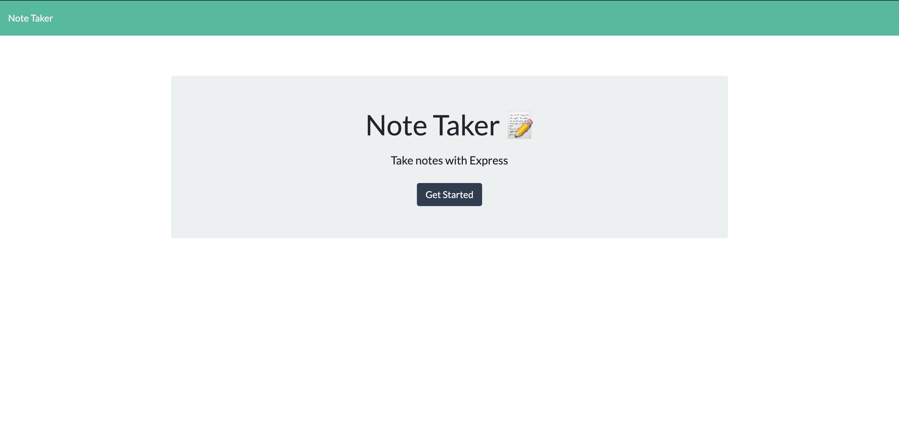
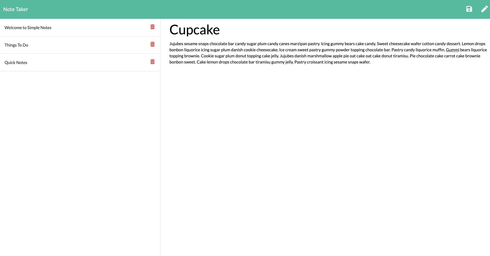

# Simple Notes

## Description ✏️

Let it be on-the-go, at work, or at home, a must-have is an application to write notes quick, easy and simple. Simple notes allows the user to store their notes onto their own personal db.json file. This application was built utilizing Express.js.

```
AS A small business owner
I WANT to be able to write and save notes
SO THAT I can organize my thoughts and keep track of tasks I need to complete
```
```
GIVEN a note-taking application
WHEN I open the Note Taker
THEN I am presented with a landing page with a link to a notes page
WHEN I click on the link to the notes page
THEN I am presented with a page with existing notes listed in the left-hand column, plus empty fields to enter a new note title and the note’s text in the right-hand column
WHEN I enter a new note title and the note’s text
THEN a Save icon appears in the navigation at the top of the page
WHEN I click on the Save icon
THEN the new note I have entered is saved and appears in the left-hand column with the other existing notes
WHEN I click on an existing note in the list in the left-hand column
THEN that note appears in the right-hand column
WHEN I click on the Write icon in the navigation at the top of the page
THEN I am presented with empty fields to enter a new note title and the note’s text in the right-hand column
```
Deployed on Github: https://karm3nz.github.io/Simple-Notes/
Deployed on Heroku: https://simple-notes-ch.herokuapp.com/

## Table of Contents 📜

If your README is very long, add a table of contents to make it easy for users to find what they need.

* [Installation](#installation)
* [Usage](#usage)
* [Credits](#credits)
* [License](#license)


## Installation 
💾

### Steps:

1) Make sure to have properly functioning computer.
2) Check if an internet browswer is installed. If so, go to step 4).
3) Install an internet browser of your choice. 
4) Open up internet web browser.
5) In the address bar, type in : https://karm3nz.github.io/Simple-Notes/ and hit "enter" on the keyboard.


## Usage 
🔧

Simple Notes allows user to retrieve, write and save personal notes.

To arrive at Simple Notes web page, type in : https://karm3nz.github.io/Simple-Notes/ on the address bar on the web browser and hit the "enter" key.




## Credits 
📣
* Pointing public directory that contains static files:
    https://www.digitalocean.com/community/tutorials/nodejs-how-to-use__dirname
    https://expressjs.com/en/starter/static-files.html
* req.param
    http://expressjs.com/en/5x/api.html#req.param
*uniqid
    https://www.npmjs.com/package/uniqid


## License 
🛡️

MIT License

Copyright (c) [2020] [Carmen Hui]

Permission is hereby granted, free of charge, to any person obtaining a copy
of this software and associated documentation files (the "Software"), to deal
in the Software without restriction, including without limitation the rights
to use, copy, modify, merge, publish, distribute, sublicense, and/or sell
copies of the Software, and to permit persons to whom the Software is
furnished to do so, subject to the following conditions:

The above copyright notice and this permission notice shall be included in all
copies or substantial portions of the Software.

THE SOFTWARE IS PROVIDED "AS IS", WITHOUT WARRANTY OF ANY KIND, EXPRESS OR
IMPLIED, INCLUDING BUT NOT LIMITED TO THE WARRANTIES OF MERCHANTABILITY,
FITNESS FOR A PARTICULAR PURPOSE AND NONINFRINGEMENT. IN NO EVENT SHALL THE
AUTHORS OR COPYRIGHT HOLDERS BE LIABLE FOR ANY CLAIM, DAMAGES OR OTHER
LIABILITY, WHETHER IN AN ACTION OF CONTRACT, TORT OR OTHERWISE, ARISING FROM,
OUT OF OR IN CONNECTION WITH THE SOFTWARE OR THE USE OR OTHER DEALINGS IN THE
SOFTWARE.


